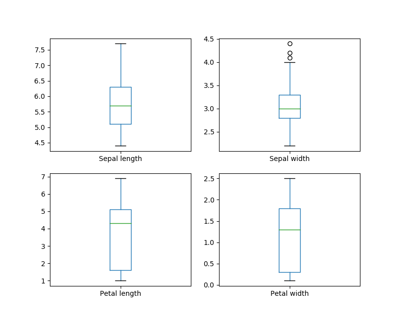
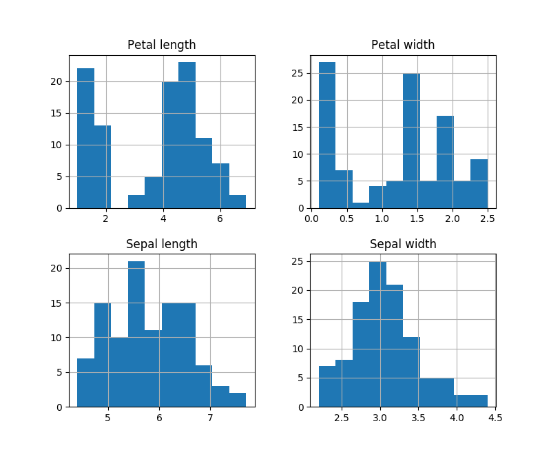
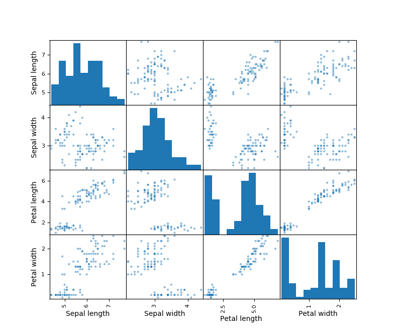

# supervised-basico-iris

## Dependencies

* Python 3

### Python VirtualEnv

* Install

```bash
apt install python-virtualenv 
```

* Create 

```bash
mkdir env
virtualenv -p /usr/bin/python3 env
env/bin/pip install -r requirements.txt
```

### Run

```bash
./starter_code.py
```

## Especifications

El [iris](https://es.wikipedia.org/wiki/Iris_flor_conjunto_de_datos) es un conjunto de datos muy famoso por su simplicidad y a la vez es muy usado en ejemplos simples de libros y herramientas de Machine Learning. El conjunto de datos tiene cuatro variables que identifican a tres especies de flores diferentes. El objetivo es clasificar cada flor en un tipo diferente en función de las cuatro variables. Las cuatro variables son:

* Ancho del pétalo
* Ancho del sépalo
* Largo del pétalo
* Largo del sépalo

Las tres especies de Iris que se desean clasificar son:

* Iris setosa
* Iris virginica
* Iris versicolor

El conjunto de datos contiene en total 150 muestras, las cuales fueron divididas en entrenamiento y prueba.


## Objetivo

Predecir la especie de flor en función de sus cuatro características físicas. Para ello se deben cumplir los siguiente objetivos específicos:

1. Entrenar un algoritmo de clasifición supervisado que tome las cuatro variables y prediga el tipo de flor. El algoritmo debe ser entrenado sólo con la base de datos de entrenamiento. 

2. Medir el desempeño sobre la base de datos de prueba. Para medir el desempeño existen muchas funciones de costo interesantes, pero en este caso usaremos una de las más comunes llamada *Accuracy*. Consiste en dividir la cantidad de aciertos en la predicción del tipo de especie de los datos de prueba sobre la cantidad total de muestras en la base de datos de prueba.

## Formato de Datos

Los datos están ubicados en la carpeta data. Existen dos archivos: *iris_train.csv* e *iris_test.csv*, los cuales son los datos de entrenamiento y prueba respectivamente. Los datos de entrenamiento tienen 105 muestras y los datos de prueba tienen 45 muestras. Recordemos que los datos de entrenamiento son sobre los cuales se entrena el algoritmo y los datos de prueba sobre los que se obtiene el desempeño real de este.

## Variables

Tanto los datos de entrenamiento como prueba constan de 5 columnas: las primeras cuatro corresponden a los descriptores de la flor (ancho y largo de sépalos y pétalos) y la última columna corresponde a la clase de flor. Esta clase de flor es la variable nominal que se desea predecir. Ya que se tiene una variable objetivo y discreta que se desea predecir se dice que este es un problema de clasifición supervisado. 

Sepal length | Sepal width | Petal length | Petal width | Class |
---------|----------------|---------|------------|----------------|
4.7 | 2.32 | 1.3 |0.2 | Iris-setosa |

## Recomendaciones

Para escoger el tipo de algoritmo que se usará se debe tener en cuenta que es un problema supervisado de clasificación con variables clases. A continuación se mencionan algunos que pueden resultar útiles:

- Regresión logística multinomial (la regresión logística binomial no funciona porque se tienen 3 clases).
- Redes neuronales
- Arboles de decisión
- Random Forest

Ya que se tienen pocos datos y es un problema relativamente fácil de resolver se recomienda usar algoritmos con parámetros simples (redes neuronales con pocas capas, arboles aleatorios con pocos árboles) porque de lo contrario se puede incurrir en el sobreajuste del modelo lo que entregará desempeño pésimo sobre los datos de prueba.

## Getting started

Para resolver el reto primero debes clonar el repositorio usando el siguiente comando en git:

`git clone https://github.com/{username}/supervised-basico-iris
cd supervised-basico-iris `

## Starter code en Python

A continuación se presenta el código inicial para leer los datos. ¡Ahora te toca a ti continuar!

```python
#Importar librerías
import pandas as pd

#Leer datos
train = pd.read_csv("data/iris_train.csv")
test = pd.read_csv("data/iris_test.csv")

#Explorar primeros registros
train.head()
train.head()

```
## Starter code en R

``` R

#Leer datos
train = read.csv("data/iris_train.csv")
test = read.csv("data/iris_test.csv")

#Explorar primeros registros
head(train)
head(test)
```

___

## Data Visualization

| Box and whisker | Histogram |
|--|-----------|
|  |  |

 